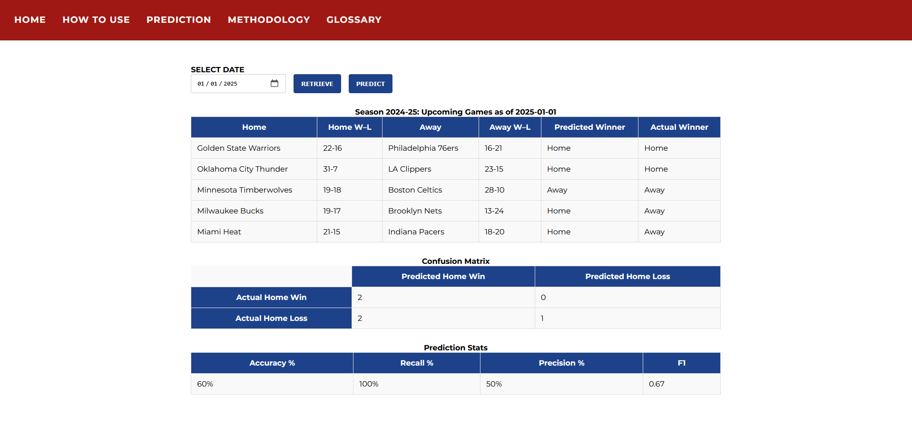

# GameMaker

GameMaker bridges the gap between complex basketball data and everyday fans by offering an interactive, intelligent prediction platform powered by machine learning. It takes the guesswork out of sports analytics by utilizing machine learning to make future predictions from past games.

Key Features
- allows users to make data-informed predictions
- simplifies complex stats through an intuitive UI and matchup simulations
- allows for exploration of historical trend and player performance 


## Preview 


## Technologies
Front End:
- HTML
- JavaScript
- CSS

Back End: 
- Python (Flaks)

API: 
- Google Firebase Authentication API
- NBA API
- ESPN API


Database:
- SQL

Machine Learning Models:
-

## Setup/Run
To setup the program, run the following commands: 
```bash
git clone https://github.com/keirannnelson/GameMaker.git
pip install -r requirements.txt
```

Afterwards, you must add your API information from Firebase to the frontend folder with the name 'firebase_config.json'. Next you must set your secret key. To do so create a file named '.env' in the root directory and enter `FIREBASE_SECRET_KEY=YOUR_KEY_HERE`.

Now to run the program, make sure you are in the root directory and execute the command below.
```bash
python -m frontend.app
```


